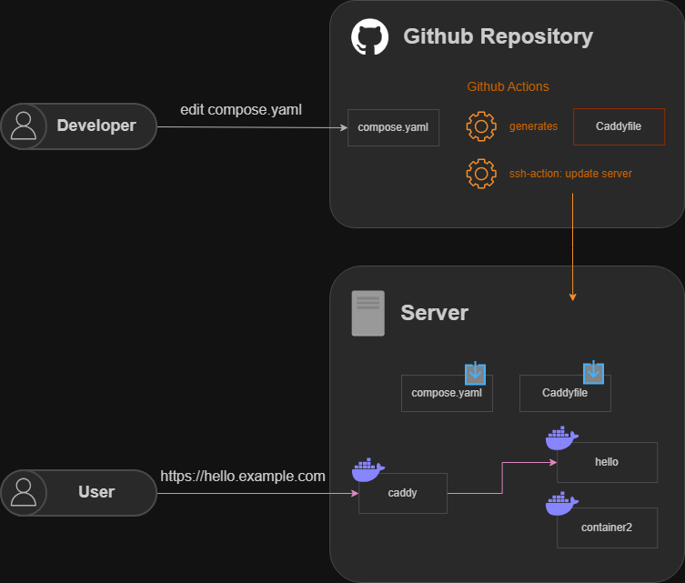

> [!CAUTION]
> AI Generated README. May be wrong.

# monoserver

## Overview

**monoserver** automates the deployment of Docker containers with subdomain-based routing and automatic HTTPS certificates. Simply update `compose.yaml`, push to GitHub, and let GitHub Actions handle deployment, SSL certificates, and reverse proxy configuration.

### Key Features

- **Git-based deployment**: Push to GitHub triggers automatic updates
- **Subdomain routing**: Each service gets its own subdomain (e.g., `hello.yourdomain.com`)
   - **Domain required**: You need a domain name pointed to your server
- **Declarative configuration**: Services defined in standard `compose.yaml`
- **Automatic HTTPS**: Caddy automatically obtains and renews Let's Encrypt SSL certificates

## Architecture


### How Subdomain Routing Works

- **Domain**: `example.com` → Caddy welcome page
- **Service hello**: `hello.example.com` → `hello` container
- **Service whoami**: `whoami.example.com` → `whoami` container

Each service in `compose.yaml` with `x-caddy-port` gets its own subdomain automatically.

## Installation

### Prerequisites

- **Domain name** (required): You must own a domain and point it to your server's IP address
- Linux server with SSH access (e.g., Google Compute Engine, AWS EC2, etc.)
- GitHub account

### Step 1: Domain Setup

**Before starting, configure your domain's DNS:**

1. Go to your domain registrar's DNS settings
2. Add an A record pointing to your server's IP:
   - Type: `A`
   - Name: `@` (or leave blank for root domain)
   - Value: `YOUR_SERVER_IP`
   - TTL: `Auto` or `3600`
3. Add a wildcard A record for subdomains:
   - Type: `A`
   - Name: `*`
   - Value: `YOUR_SERVER_IP`
   - TTL: `Auto` or `3600`

**Verify DNS propagation:**
```bash
# Check if domain resolves to your server IP
ping yourdomain.com
```

### Step 2: Use Template Repository

1. Go to the monoserver repository on GitHub
2. Click "Use this template" → "Create a new repository"
3. Choose a name for your repository (e.g., "my-monoserver-private")
4. **Important**: Make it **Private** to protect your domain from being exposed
5. Clone your new repository locally

### Step 3: Server Setup

SSH into your server and follow these steps.

#### 1. Install Git

```bash
# Update package list and install Git
sudo apt-get update
sudo apt-get install -y git
```

#### 2. Connect to GitHub

```bash
# Configure Git (replace with your info)
git config --global user.name "Your Name"
git config --global user.email "your.email@example.com"

# Generate SSH key for GitHub
ssh-keygen -t ed25519 -C "your.email@example.com" -f ~/.ssh/id_ed25519_github
# Press Enter for all prompts (no passphrase recommended for automation)

# Start ssh-agent in the background
eval "$(ssh-agent -s)"
# Expected output: Agent pid ...

# Add SSH private key to ssh-agent
ssh-add ~/.ssh/id_ed25519_github

# Display the public key (for adding to GitHub)
cat ~/.ssh/id_ed25519_github.pub
```

**Add the public key to GitHub (via web browser):**
1. Copy the entire output from `cat ~/.ssh/id_ed25519_github.pub` command
2. Open https://github.com in your **web browser**
3. Click your profile picture (top right) → **Settings**
4. In the left sidebar, click **SSH and GPG keys**
5. Click **New SSH key** button
6. Give it a title (e.g., "GCE monoserver")
7. Paste the public key into the "Key" field
8. Click **Add SSH key**

**Test GitHub connection:**
```bash
# Test SSH connection to GitHub
ssh -T git@github.com

# First time connecting: You'll see a fingerprint verification message
# Verify the fingerprint matches GitHub's (SHA256:+...)
# Type: yes

# You should see: "Hi username! You've successfully authenticated..."
```

#### 3. Clone Repository

```bash
# Clone your repository using SSH (replace YOUR_USERNAME and YOUR_REPO_NAME)
git clone git@github.com:YOUR_USERNAME/YOUR_REPO_NAME.git
cd YOUR_REPO_NAME
```

#### 4. Install Docker (Rootless Mode)

Use the automated installation script included in the repository:

```bash
# Run the Docker rootless installation script with sudo
sudo bash scripts/install-docker-rootless.sh
```

The script will:
- Install prerequisites (uidmap)
- Install Docker in rootless mode
- Configure PATH and environment variables
- Enable Docker service to start on boot
- Set up privileged port binding (80, 443)
- Verify installation

Expected output looks like:
```
Docker Info:
Client:
 Version:           29.0.3
 Context:           rootless
 Plugins:
  compose:          v2.40.3

Server:
 Containers:        3 (Running: 0, Stopped: 3)
 Server Version:    29.0.3
 Security Options:  name=seccomp,profile=builtin name=rootless name=cgroupns
```

**Verify Docker is working:**
```bash
docker ps
docker compose version
```

#### 5. Set Up GitHub Actions SSH Access

Generate a dedicated SSH key for GitHub Actions to use:

> [!NOTE]
> Path `~/.ssh/github_actions` will be used in workflow. Do not change it.

```bash
# Generate SSH key for GitHub Actions.
ssh-keygen -t ed25519 -C "github-actions" -f ~/.ssh/github_actions
# Press Enter for all prompts (no passphrase)

# Add public key to authorized_keys
cat ~/.ssh/github_actions.pub >> ~/.ssh/authorized_keys

# Display private key (you'll add this to GitHub Secrets)
cat ~/.ssh/github_actions
```

Copy the entire private key output (including `-----BEGIN` and `-----END` lines).

### Step 4: Configure GitHub Repository Secrets

Add these secrets to your repository:

1. Go to your repository on GitHub
2. Settings → Secrets and variables → Actions
3. Click "New repository secret" for each:

| Secret Name | Value | Example |
|------------|-------|---------|
| `GCE_HOST` | **Your domain name** | `yourdomain.com` or `example.com` |
| `GCE_USER` | Your server username | Run `whoami` on the server |
| `GCE_SSH_KEY` | Private key for GitHub Actions | Output from `cat ~/.ssh/github_actions` |

**⚠️ Important**: `GCE_HOST` must be your domain name, not an IP address.

### Step 5: Initial Deployment

#### Trigger GitHub Actions Workflow

1. Go to your repository on GitHub
2. Click the **Actions** tab
3. Click "Deploy to Server" workflow (left sidebar)
4. Click "Run workflow" button (right side)
5. Select `main` branch
6. Click "Run workflow"

#### What Happens During Deployment

1. ✅ Generates `Caddyfile` with subdomain routes from `compose.yaml`
2. ✅ Commits `Caddyfile` back to repository (if changed)
3. ✅ SSHs into your server
4. ✅ Pulls latest code
5. ✅ Runs `docker compose up -d` (starts/updates containers)
6. ✅ Validates and reloads Caddy configuration
7. ✅ Caddy automatically obtains Let's Encrypt SSL certificates

**First deployment takes a few minutes** as Caddy requests SSL certificates from Let's Encrypt.

#### Verify Deployment

Check if services are running:
```bash
# On your server
docker compose ps

# Check Caddy logs
docker compose logs caddy
```

### Step 6: Access Your Services

Once deployment completes, access your services via HTTPS:

**Browser access:**
- `https://yourdomain.com` → Caddy welcome page
- `https://hello.yourdomain.com` → Hello service
- `https://whoami.yourdomain.com` → Whoami service

**Command line test:**
```bash
# Test from your local machine
curl https://yourdomain.com
curl https://hello.yourdomain.com
curl https://whoami.yourdomain.com
```

🎉 **You should see valid SSL certificates!** Caddy automatically obtained certificates from Let's Encrypt.

## Usage

### Adding a New Service

1. **Edit `compose.yaml`** and add your service with `x-caddy-port`:

```yaml
services:
  caddy:
    # ... existing caddy config ...

  hello:
    image: hashicorp/http-echo
    command: ["-text=Hello!"]
    x-caddy-port: "5678"  # The port your app listens on

  myapp:
    image: myapp:latest
    x-caddy-port: "8080"  # ← Add this line
```

2. **Commit and push:**

```bash
git add compose.yaml
git commit -m "[services] add myapp service"
git push origin main
```

3. **GitHub Actions automatically:**
   - Generates `Caddyfile` with `myapp.yourdomain.com` route
   - Commits the `Caddyfile` back to repository
   - Deploys to server
   - Caddy obtains SSL certificate for `myapp.yourdomain.com`
   - Service becomes available at `https://myapp.yourdomain.com`

**That's it!** No manual SSL certificate configuration needed.

### How the `x-caddy-port` Field Works

The `x-caddy-port` field tells Caddy which port your container listens on:

```yaml
myapp:
  image: myapp:latest
  x-caddy-port: "8080"
```

This generates the following Caddy configuration:
```
myapp.yourdomain.com {
  reverse_proxy myapp:8080
}
```

**Services without `x-caddy-port` are not exposed** via Caddy.
- They can still run internally or be accessed via other means (e.g., Docker networks).

### Removing a Service

1. Remove the service from `compose.yaml`
2. Commit and push
3. GitHub Actions automatically:
   - Removes the subdomain route from `Caddyfile`
   - Stops the container on the server
   - Caddy revokes the SSL certificate


## How It Works

### Subdomain Routing

When you add a service with `x-caddy-port`:
```yaml
hello:
  image: hashicorp/http-echo
  x-caddy-port: "5678"
```

The `caddyfile-generator` creates:
```
hello.yourdomain.com {
  reverse_proxy hello:5678
}
```

This means:
- Request to `https://hello.yourdomain.com`
- → Caddy receives request, terminates SSL
- → Caddy proxies to `http://hello:5678` (internal Docker network)
- → Response sent back with SSL

### Zero-Downtime Reloads

When `Caddyfile` changes, the deployment workflow runs:
```bash
docker compose exec -w /etc/caddy caddy caddy reload
```

Caddy:
- ✅ Reads new configuration
- ✅ Starts new worker processes
- ✅ Gracefully shuts down old workers
- ✅ **No dropped connections or downtime**

### Git-Based Workflow

```
Developer pushes to GitHub
         ↓
GitHub Actions triggered
         ↓
Generate Caddyfile from compose.yaml
         ↓
Commit Caddyfile back to repository
         ↓
SSH to server
         ↓
Pull latest code
         ↓
docker compose up -d
         ↓
Caddy reload (zero downtime)
         ↓
SSL certificates auto-renewed if needed
```

## Project Structure

```
monoserver/
├── compose.yaml                    # Docker Compose service definitions
├── Caddyfile                       # Auto-generated Caddy configuration
├── caddyfile-generator/            # TypeScript generator for Caddyfile
│   ├── src/
│   │   ├── index.ts                # Main generator logic
│   │   └── test-runner.ts          # Test suite
│   ├── test/                       # Test cases
│   └── package.json                # npm scripts: generate, test
├── scripts/
│   └── install-docker-rootless.sh  # Docker installation script
├── .github/
│   └── workflows/
│       └── deploy.yml              # Deployment automation
└── README.md                       # This file
```

## Local Development

For local testing without a domain:

```bash
# Generate Caddyfile
cd caddyfile-generator
npm install
npm run generate

# Start all services locally
cd ..
docker compose up

# Access via localhost subdomains (add to /etc/hosts)
# 127.0.0.1 hello.localhost whoami.localhost
curl http://hello.localhost
curl http://whoami.localhost

# View logs
docker compose logs -f caddy

# Stop services
docker compose down
```

**Note**: Local development won't have HTTPS because Let's Encrypt requires a valid domain. Caddy will serve HTTP only for `localhost`.

## Troubleshooting

### SSL Certificate Not Working

**Check if Caddy obtained certificates:**
```bash
docker compose exec caddy caddy list-certificates
```

**Common issues:**
- Domain not pointing to server IP → Check DNS with `ping yourdomain.com`
- Firewall blocking ports 80/443 → Check with `sudo ufw status` or cloud provider firewall
- Rate limit from Let's Encrypt → Wait 1 hour or use staging certificates

**Check Caddy logs:**
```bash
docker compose logs caddy | grep -i "certificate"
```

### Service Not Accessible

**Verify container is running:**
```bash
docker compose ps
```

**Check if service has `x-caddy-port`:**
```bash
grep -A 2 "myservice:" compose.yaml
```

**Verify Caddyfile was generated:**
```bash
cat Caddyfile | grep myservice
```

**Test internal connectivity:**
```bash
docker compose exec caddy wget -O- http://myservice:PORT
```

### GitHub Actions Deployment Failing

**Check secrets are set correctly:**
- `GCE_HOST` should be your domain (e.g., `example.com`), not IP
- `GCE_USER` should match server username
- `GCE_SSH_KEY` should be complete private key with BEGIN/END lines

**Check SSH connectivity:**
```bash
# From local machine
ssh -i ~/.ssh/your_key YOUR_USER@YOUR_DOMAIN
```

## Security Considerations

- **Use private repository** to prevent exposing your domain name
- **Don't commit secrets** to the repository (use GitHub Secrets)
- **Keep Docker updated** for security patches
- **Use rootless Docker** (included in installation script)
- **SSL certificates auto-renewed** by Caddy
- **Firewall recommended**: Only allow ports 22 (SSH), 80 (HTTP), 443 (HTTPS)

## License

This project is open source and available under the MIT License.
